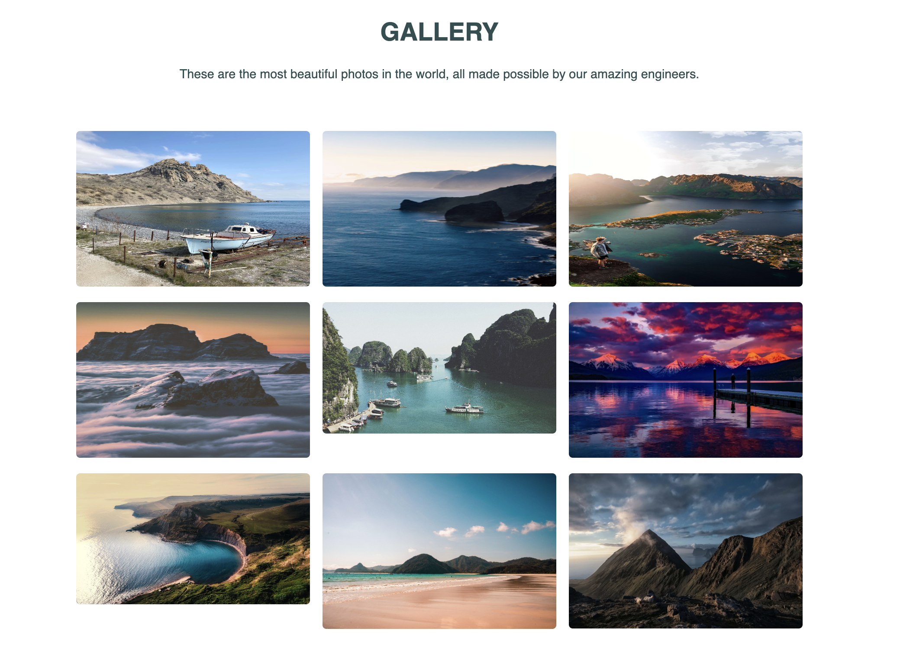
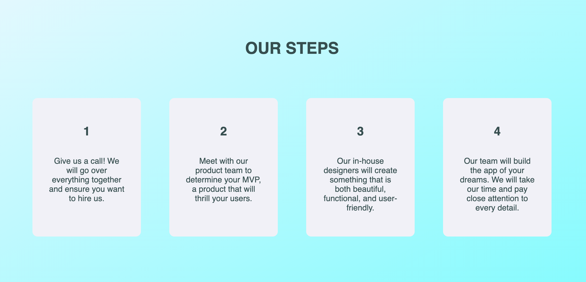
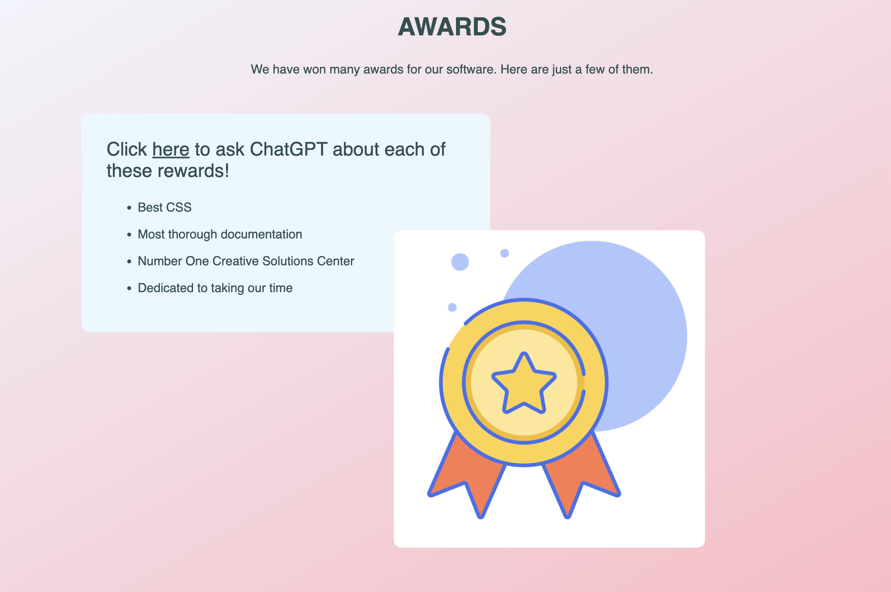

# In-Class Activity Instructions

### Headers Section PART ONE (Headers)

#### Read these instructions at least once before you begin.
1. Navigate to the index.html file.
2. Take 10 minutes to look over the code. It's ok if it doesn't make sense yet.
3. Find the `<section>` tag that has a class attribute with a value of "headers-section."
4. Add 6 headers, from `<h1>` to `<h6>`, inside the `<section>` tag. The text that is rendered to the screen should reflect the tag that is wrapped around it. So the `<h1>` should let the user know "this is an h1", `<h2>` renders "this is an h2", and so on.
5. To see your code, right-click your html file in vscode and click on 'open with live server'.

### Headers Section PART TWO (Anchor Tags)

#### Read these instructions at least once before you begin.
1. Turn each one of your headers into a hyperlink using the `` tag.
2. For `h1-h3`, link just one word. When the user clicks the link, it should take them to your GitHub profile.
3. For `h4-h6`, link more than one word to Google's home page.
4. Google "attribute to open link in new browser tab HTML."
5. Add an attribute to your `<h1>` that will open the link in a new browser tab
6. To see your code, right-click your html file in vscode and click on 'open with live server'.

### Footer (Buttons)

#### Read these instructions at least once before you begin.
1. Find the footer section in the HTML.
2. Add your code inside of the `
` with a class of "buttons-wrapper."
3. Add four buttons, each with a class attribute with a value of "button."
   a. Contact
   b. Learn
   c. Request
   d. Donate
4. To see your code, right-click your html file in vscode and click on 'open with live server'.

### Gallery Section (Images)

#### Read these instructions at least once before you begin.
1. Navigate to the Gallery Section of the HTML.
2. Inside the gallery-text-wrapper `
`, add an `<h1>` and paragraph to match the design below.
3. Find the images-wrapper `
`.
4. Add all nine gallery images using relative paths.
5. Add meaningful tags to each image.
6. This is what your page should look like:
   
7. To see your code, right-click your html file in vscode and click on 'open with live server'.

### NAVBAR (Unordered List, Image)

#### Read these instructions at least once before you begin.
1. Look for the `<nav></nav>` section in the html.
   a. All of your code will go between the opening and closing '<nav>` tags.
2. Look in your assets folder and see there is a file there called ac-logo.jpg.
3. Back in your HTML, under the opening `<nav>` tag, add the logo to the navbar
   a. add a **class attribute** with a value of "nav-logo" to the image tag.
   b. Add an alt tag.
4. Create an **unordered list** with three list items.
   a. HOME
   b. ABOUT
   c. CONTACT
5. To see your code, right-click your html file in vscode and click on 'open with live server'.
6. Move on to the next section: Our Certification Process.

### Our Certification Process (Ordered List)

#### Read these instructions at least once before you begin.
1. Find the section with a class of "certification-section."
2. Below the header that says **Our Certification Process**, create an ordered list with four list items:
   a. Internal Testing
   b. Beta Testing with a Small Group
   c. Make Changes Based on Feedback
   d. Present the Software to the World!
3. To see your code, right-click your html file in vscode and click on 'open with live server'.

### Divs

#### Read these instructions at least once before you begin.
1. Find the `<section>` with a class attribute that has a value of "parent-child-section."
2. Write your code between the 

 tags.
3. Add a `
` with a class of "steps-card."
4. Inside of that `
`, use an `<h1>` tag to put a **1** on the screen.
5. After the `<h1>`, add a paragraph with the following text: "Give us a call! We will go over everything together and ensure you want to hire us."
6. Take a look in the browser!
7. The `<h1>` and the paragraph should be **siblings**. Their **parent** is the steps-wrapper `
`.
8. Make three more `divs` that have identical structure; look in the browser as you go.
9. For the second `
`, change the `<h1>` so it renders a 2, and change the paragraph to say: "Meet with our product team to determine your MVP, a product that will thrill your users."
10. For the third `
`, change the `<h1>` so it renders a 3, and change the paragraph to say: "Our in-house designers will create something that is both beautiful, functional, and user-friendly."
11. For the fourth `
`, change the h1 so it renders a 4, and change the paragraph to say: "Our team will build the app of your dreams. We will take our time and pay close attention to every detail."
12. This is what your page should look like:
    
13. To see your code, right-click your html file in vscode and click on 'open with live server'.

### HERO SECTION (h1, p, button, form)

#### Read these instructions at least once before you begin.
1. Find the section with a class of "hero-section"
2. Create a div with a class of "hero-wrapper"
3. Inside of the "hero-wrapper" `
`, create a `
` with a class of "text-wrapper"
4. Inside of the "text-wrapper" `
`, add an `<h1>` tag with a class of "hero-header". Add the text from [the design](./assets/form-section.png).
5. Add a `
` tag that is a SIBLING to the `<h1>` with the text from [the design](./assets/form-section.png).
6. Add a `<button>` tag that is a sibling to the `
` tag and the `<h1>` with the text from [the design](./assets/form-section.png).
7. Link the button to anniecannons.org.
8. Create a `
` with a class of "form-wrapper" that is a CHILD of the "hero-wrapper" `
` and a sibling of the "text-wrapper" `
`.
9. Add an `<h1>` tag with the text from [the design](./assets/form-section.png) that is a child of the "form-wrapper" `
`.
10. Create your form. Follow [the designs](./assets/form-section.png).
    a) Each input tag should have the following attributes: type, id, name, required, placeholder.
    b) The select tag should have the following attributes: id, name, required.
    i. The **first** option tag should have the following attributes: value, disabled, selected.
    ii. The second and third option tags should have the following attributes: value
    c) The submit input tag should have the following attributes: type, value
11. To see your code, right-click your html file in vscode and click on 'open with live server'.

### Awards Section (Practice)

#### Read these instructions at least once before you begin.
1. Check out the design below.
2. What elements do you see in the design?
3. Look at the HTML for the `<section>` with a class of "awards-section."
4. Where in the HTML will the `<h1>` and the paragraph go for the top?
   1. Add a class of "section-header" to the `<h1>`.
   2. Add a class of "awards-section-text" to the `
` tag.
5. Which content do you think goes inside the `divs`, based on their class names?
6. Re-create the design on your own!
   
7. To see your code, right-click your html file in vscode and click on 'open with live server'.
